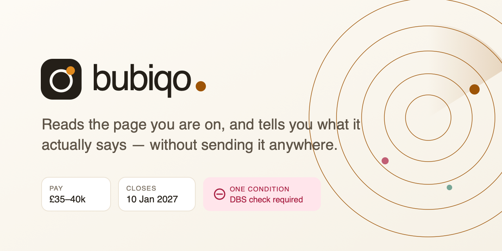
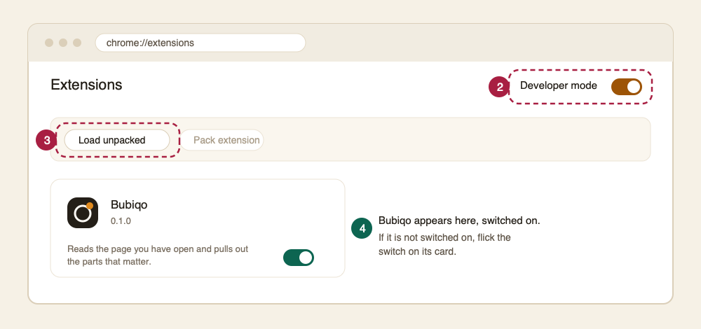
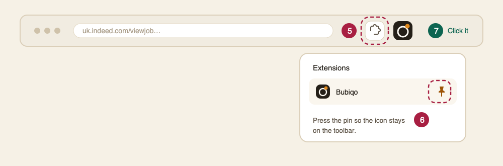
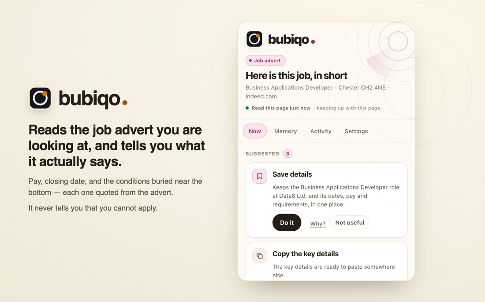

<p align="center">
  
</p>

<p align="center">
  <b>A Chrome side panel that reads whatever page you have open and pulls out the parts you would otherwise go hunting for.</b>
</p>

<p align="center">
  
  
  
  
  
</p>

---

## Install it

Bubiqo is not on the Chrome Web Store yet, so you load it yourself. About two
minutes. You need [Node.js 20+](https://nodejs.org) and Chrome 116 or newer.

### Step 1 — build it

```bash
git clone https://github.com/SayamDev/bubiqo.git
cd bubiqo
npm install
npm run build
```

This creates a folder called `dist`. That folder *is* the extension. Keep the
terminal open — you will want the path in step 5.

### Steps 2, 3 and 4 — load it into Chrome



*A diagram, not a screenshot — Chrome will not let its own pages be captured.*

**2.** Open a new tab, type **`chrome://extensions`** in the address bar and press Enter.

**3.** Turn on **Developer mode**, the switch at the **top right**. Until you do,
the button you need in the next step does not exist.

**4.** Press **Load unpacked**, which has just appeared at the **top left**.

### Step 5 — choose the `dist` folder

In the file picker, open the `bubiqo` folder you cloned, click once on **`dist`**
to select it, and press **Select**.

Pick `dist` itself — not the `bubiqo` folder around it, and not a file inside
`dist`. If you get *"Manifest file is missing or unreadable"*, the wrong folder
was selected; try again.

> **Shortcut:** in the picker press <kbd>⌘</kbd><kbd>⇧</kbd><kbd>G</kbd> (macOS)
> and paste the path. Run `pwd` in your terminal from step 1 and add `/dist`.

Bubiqo now appears in the list with its switch on.

### Steps 6 and 7 — pin it, then click it



**6.** Press the **puzzle piece** at the right of the toolbar, find **Bubiqo**,
and press the **pin** beside it. Its icon now stays on the toolbar.

**7.** Open any job advert, email or invoice, and **click the Bubiqo icon**. The
panel opens beside the page and reads it.

The first time you use it on a site, Chrome asks whether Bubiqo may read that
site. It cannot read anything until you say yes, and you can take the permission
back at `chrome://extensions` whenever you like.

This is what you should see:



**On a busy page** — a job board with twenty adverts on screen — select the advert
you mean, right-click, and choose **"Read this with Bubiqo"**. Selecting is the
one unambiguous way to say which part of a page you mean, and it cannot be broken
by a site redesign.

### If something goes wrong

| What you see | What to do |
|---|---|
| **"Manifest file is missing or unreadable"** | The wrong folder was picked in step 5. It must be `dist`, the folder containing `manifest.json`. |
| **Clicking the icon does nothing** | Reload the extension: `chrome://extensions` → the reload icon on the Bubiqo card. |
| **The panel says it needs permission** | Press **Allow**. Or grant it at `chrome://extensions` → Bubiqo → Site access. |
| **The panel is blank on a `chrome://` page** | No extension may read Chrome's own pages. Open an ordinary web page. |
| **You changed the code** | Run `npm run build`, then press reload on the Bubiqo card. |

---

## What it reads

| | What it pulls out |
|---|---|
| **Job adverts** | Pay, closing date, contract, location, the requirements, and any condition the advert sets — DBS, clearance, right to work — each quoted from the text |
| **Emails** | The deadline, what was asked of you, and what you promised |
| **Invoices** | Supplier, total, reference, due date |
| **Anything carrying a date** | Bookings, renewals, appointments, tickets, course deadlines |

Then it offers to **save it** to a local memory you can search later, **copy the
details**, **set a reminder**, or **make a calendar file**. It never sends,
submits, posts or pays, and it cannot read a page you have not opened it on.

### On a job advert

| | |
|---|---|
| **Pay** | £35,000–40,000 · *stated by the site* |
| **Closes** | 10 Jan 2027 · *stated by the site* |
| **Conditions** | DBS check required — *"This post is subject to an enhanced DBS check."* |
| **Asks for** | the eight requirements, quoted in the advert's own words |

Every fact says where it came from — the site's own structured data, or the prose
— because those are different kinds of claim and you should be able to tell them
apart. Nothing is inferred that cannot be quoted.

## The part that matters

**It never tells you that you cannot apply.**

An advert asking for a DBS check says nothing about whether you hold one, or could
hold one in a fortnight. Earlier versions said *"Ruled out"* — the product claiming
knowledge it has no way of having, and ruling people out of jobs nobody had ruled
them out of. Conditions are now stated as what they are: what the advert asks, with
the sentence it asks in, and a button that says **I have this**. Press it once and
every future advert asking the same thing shows it as met.

## Privacy, as a property of the build

Not a promise in a policy — things you can check in `manifest.json` in thirty seconds:

- **No host permissions at install.** `optional_host_permissions` only, granted per
  site, in the product, after you have seen it work. The install prompt asks for
  nothing about your browsing.
- **No content scripts.** Nothing runs on any page until you open the panel on it.
- **One network call in the entire codebase** — an exchange rate, off by default,
  sending a currency pair and nothing else. CSP pins `connect-src` to that one host.
- **Page text is never stored.** Only extracted entities are, and only what you
  explicitly save.
- **No model, no server, no account.** The analysis is deterministic: regular
  expressions, date arithmetic and structured-data reading. Same page in, same
  answer out — which is why it can be tested exhaustively and why it works offline.

## How it is built

```
extension/src/core/         pure TypeScript — no chrome.*, no DOM, no React
  job-posting.ts            schema.org JobPosting, normalised
  job-brief.ts              the brief: conditions, pay, dates, requirements
  entity-engine.ts          dates, amounts, people, organisations, references
  problem-radar.ts          what has a deadline and needs you
  actions.ts                the Action Registry — nothing outside it can run
  safety.ts                 risk tiers: safe / confirm / blocked
extension/src/background/   the service worker and the injected extractor
extension/src/sidepanel/    the panel — React, no framework beyond it
tests/captured/             real pages, captured through the real extractor
```

**Actions carry a risk tier.** `safe` runs without asking. `confirm` never runs
without approval in the moment. `blocked` — payments, credentials, account deletion
— never runs at all, and exists so the refusal is visible rather than implied.

**Every action verifies itself.** A step reports done only when a check confirms the
result exists. *"We could not confirm"* is a valid outcome and always preferred to a
false success.

## Tested against real pages, not fixtures I wrote

`tests/captured/` holds pages captured through the extension's own extractor —
LinkedIn, Indeed, an NHS Jobs advert, a Greenhouse posting, an Ashby posting. They
are not hand-written, and that is the point: each one has found a fault no invented
fixture would have.

- The NHS advert says *"Disclosure and Barring Service"*, never *"DBS check"* — a
  whole sector's standard wording read as no condition at all.
- Indeed's search page puts the advert in a pane seven levels below `<main>`; the
  extractor never measured it, so a brief carried three other adverts' salaries and
  named the employer *"New"* — a badge on a neighbouring card.
- LinkedIn's first heading is now an AI upsell, and briefs were titled *"Use AI to
  assess how you fit"*.

```bash
npm run verify            # typecheck, lint, 477 tests, build
npm run dev               # rebuild on change
npm run capture-snippet   # build the fixture-capture console snippet
```

## Decisions worth reading

- [ADR 0001](docs/adr/0001-no-host-permissions.md) — asking for page access in the
  product rather than at install, and the amendment after it met a real inbox.
- [ADR 0002](docs/adr/0002-deterministic-core.md) — why there is no model.
- [ADR 0003](docs/adr/0003-structured-data-first-job-reading.md) — reading the
  advert the site published, including the claim the evidence later disproved.
- [CONTEXT.md](CONTEXT.md) — the domain glossary. Code, tests and docs use these
  words and no synonyms.
- [PRIVACY.md](PRIVACY.md) · [SECURITY.md](SECURITY.md)

## Status

Working and unpublished. Not on the Chrome Web Store. Email, invoice and generic
surfaces work; job adverts are the most developed. Non-English pages are largely
unsupported, and the condition rules are UK-centric — both stated in ADR 0002 as
known limits rather than discovered later.

MIT licensed.
